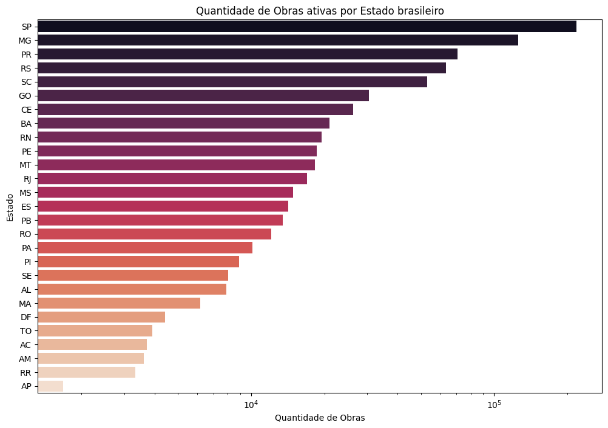
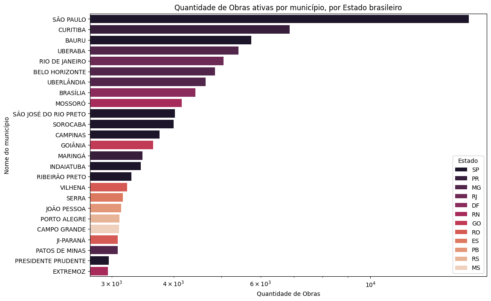
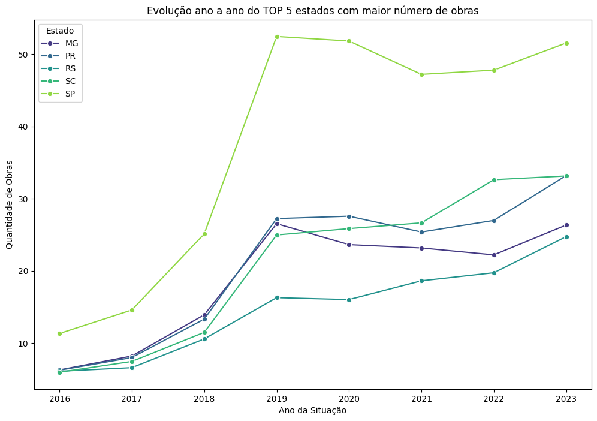
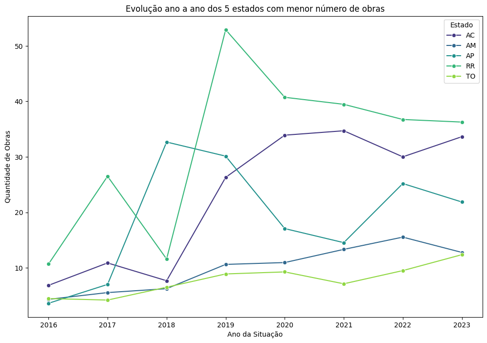
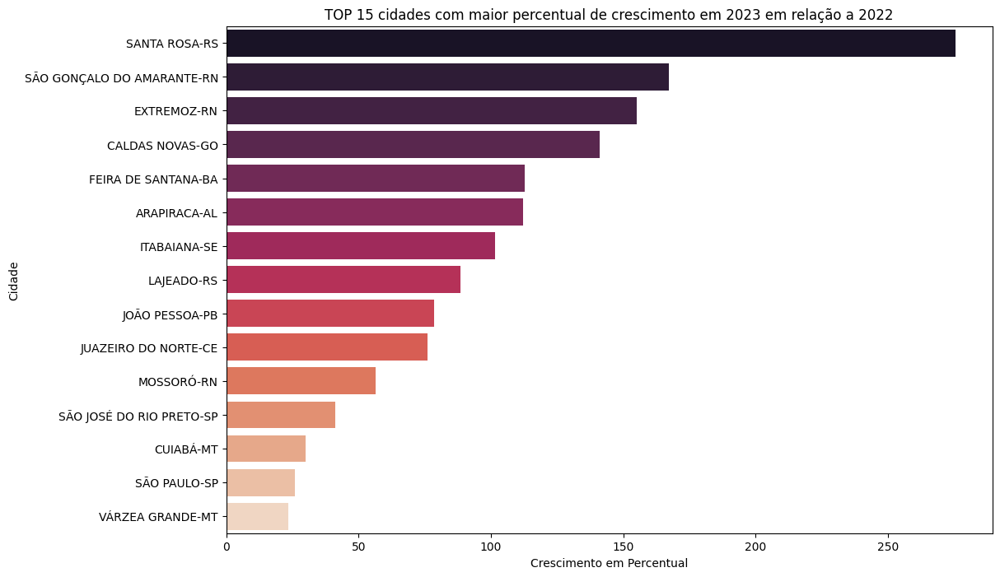
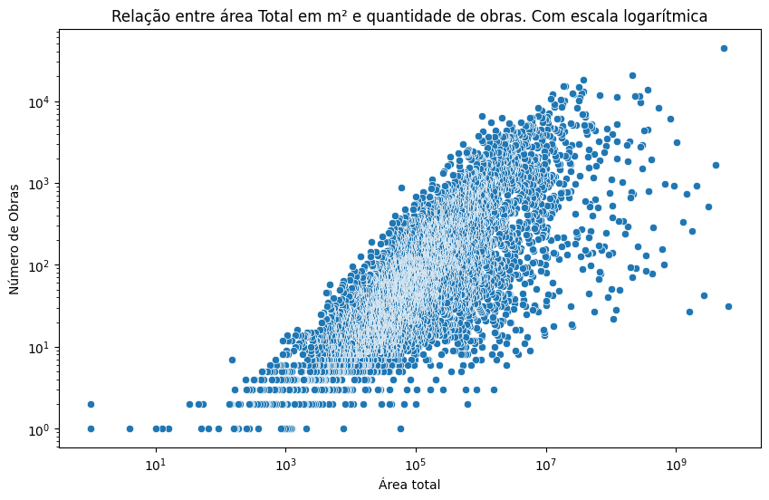
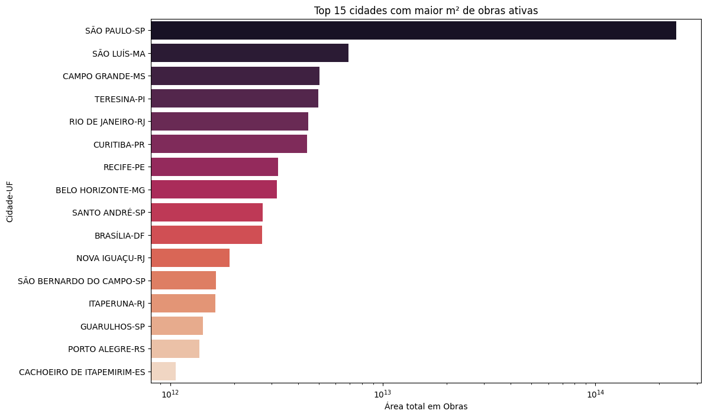
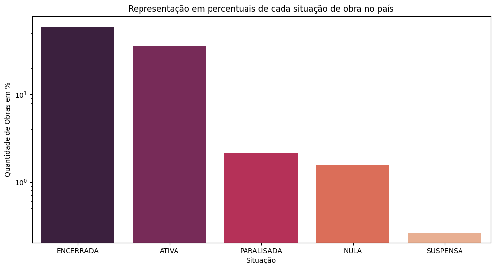

# Análise Exploratória de Dados - Setor de Construção Civil

## Contexto

Este projeto de análise exploratória de dados concentra-se no setor de construção civil, utilizando o Cadastro Nacional de Obras (CNO) disponível no [Site Oficial Dados Gov.Br](https://dados.gov.br/dados/conjuntos-dados/cadastro-nacional-de-obras-cno). A iniciativa visa fornecer insights estratégicos para uma empresa varejista do setor, permitindo uma tomada de decisão fundamentada em dados para otimizar seus investimentos.

## Objetivo

O objetivo principal deste estudo é revelar insights sobre o momento atual das obras no país, identificando áreas com alto potencial de investimento e estratégias para intensificar a atuação da empresa no mercado. Especificamente, buscamos responder às seguintes questões:

- Quais são as cidades e estados com mais obras em andamento?
- Essas cidades e estados estão em crescimento ou já estagnaram?
- Como está o comportamento de obras ativas desde 2016 nas 5 cidades com maior número de obras?
- Quais são as 15 cidades com número de obras em crescimento em relação ao ano passado?
- Qual a relação da área total da obra versus a quantidade de obras num determinado município?
- Qual o percentual que representa cada situação de obras, como um todo?

## Metodologia

O projeto foi dividido em seis etapas principais:

1. **Carregamento dos Dados:** Importação do conjunto de dados para análise.
2. **Análise Preliminar:** Exploração inicial para entender a estrutura e os tipos de dados disponíveis.
3. **Limpeza dos Dados:** Tratamento de valores ausentes, duplicados e correção de tipos de dados, quando necessário.
4. **Parametrização das Variáveis:** Definição de variáveis de interesse para análise.
5. **Visualização de Dados:** Geração de gráficos e tabelas para responder às questões de pesquisa.
6. **Conclusões e Insights:** Síntese das observações, conclusões e recomendações estratégicas.

## Principais Conclusões e Insights

- A distribuição geográfica das obras revelou áreas de alta atividade, indicando regiões promissoras para investimento.
 

 
Também identificamos as 25 cidades com maior número de obras ativas.
 

 
- A análise de crescimento mostrou quais regiões estão em expansão, sugerindo oportunidades de investimento em mercados emergentes.
 

 
Também verificamos como se encontra a situação e evolução dos 5 estados com menor número de obras ativas.
 

 
- A tendência histórica das obras ativas desde 2016 ajudou a identificar padrões de desenvolvimento no setor.
 
- As 15 cidades com crescimento no número de obras representam oportunidades estratégicas para antecipação ao mercado.
 

 
- A relação entre a área total da obra e a quantidade de obras forneceu insights sobre o tipo de desenvolvimento predominante em diferentes regiões.
 

 
- Conseguimos enxergar as 15 cidades com maior quantidade de obras em m².
 

 
- A análise da situação das obras ofereceu uma visão geral da saúde do setor e dos riscos potenciais.
 

 

## Recomendações Estratégicas

Com base nas conclusões, recomendamos uma abordagem de investimento geograficamente focada e diversificada, priorizando regiões com alto volume de obras em andamento e em crescimento. Ajustes no portfólio de produtos e serviços devem ser considerados para atender às demandas específicas das áreas identificadas.

## Conclusão

Este projeto de análise exploratória forneceu uma base sólida para a tomada de decisões estratégicas, auxiliando a empresa a maximizar seus investimentos e reforçar sua posição no mercado de construção civil.

## Sobre os Dados

Os dados para este estudo foram obtidos do Cadastro Nacional de Obras (CNO), disponível publicamente no [Site Oficial Dados Gov.Br](https://dados.gov.br/dados/conjuntos-dados/cadastro-nacional-de-obras-cno).
